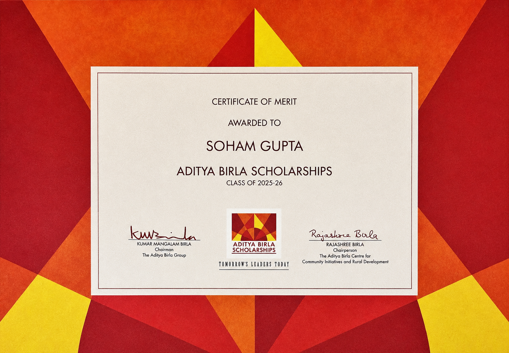

The Aditya Birla Scholarship Programme recognises the thirty most outstanding law students across India's premier law universities. Selection happens in two stages: the first filters candidates to the top twenty CLAT rankers within each university, and the second shortlists five students from that group based on essays and CV submissions. The Certificate of Merit is awarded to those who clear both stages.

I am deeply grateful to have had the opportunity to be interviewed by a panel that included former Chief Justice of India Hon. Justice Sanjiv Khanna, former Additional Solicitor General of India Madhuri Diwan, and Senior Advocate Aspi Chinoy. The discussion touched on questions I genuinely care about: the institutional architecture of technology governance, whether law constitutes the foundational order of society, and the emerging challenges of AI regulation. To sit across from some of the finest legal minds in the country and think through these questions together was nothing short of exhilarating. It was also deeply motivating, a reminder of the standard this profession demands and the kind of thinker I want to become.

Beyond the interview, the programme brought together scholars, practitioners, and institutional leaders including DRDO Chairman Dr. Samir V. Kamat. I am grateful to the Aditya Birla Group for curating an experience this rich, this early in one's legal journey. The conversations on law, governance, and public life left a lasting impression.
