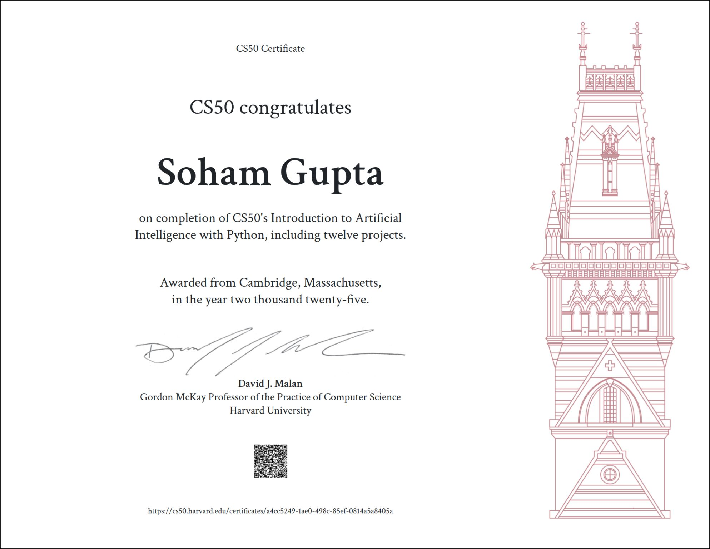

CS50AI covers the technical foundations of modern artificial intelligence: search algorithms, knowledge representation, probabilistic reasoning, machine learning, neural networks, and natural language processing. It is rigorous, demanding, and for someone coming from law and commerce, genuinely humbling at points.

I took this course not to become an engineer, but because I believe it is impossible to think seriously about how AI should be governed without first understanding how it actually works. Too much of the legal commentary on AI treats the technology as a black box, something that produces outputs, causes harms, and must therefore be regulated, without any real engagement with the mechanics underneath. I did not want to be that kind of scholar.

What I did not anticipate was how much the course would change the quality of my questions. Understanding how machine learning systems approximate truth through iteration and error, rather than through anything resembling human reasoning, reframed what I thought I understood about algorithmic decision-making. The lecture on neural networks was particularly striking: the idea that complex, almost inexplicable behaviour could emerge simply from stacking layers of elementary operations raised questions about legal accountability that I am still working through. The language module was equally unsettling, in the best possible way.

As I worked through each lecture, I found myself writing notes, not just to remember, but to think. Those notes eventually became the essays on NeuroMech, where I tried to translate what I was learning into ideas worth sitting with. Some of them turned into questions that found their way into my research on AI sycophancy and AI governance more broadly.

Grateful to Professor David Malan and the entire CS50 team for making this kind of learning genuinely accessible.

[**Read my CS50AI notes on NeuroMech**](/neuromech/)
