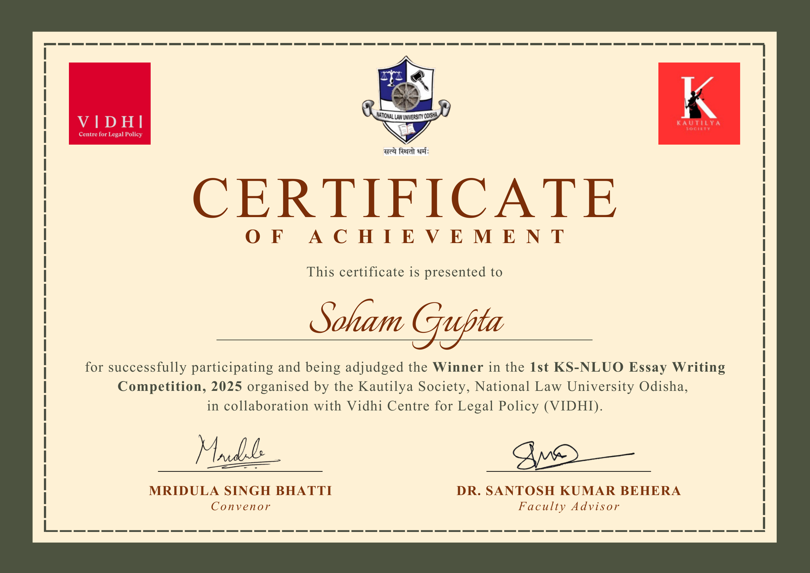

First place at the Essay Writing Competition on 'Arbitration and Policy' organised by the Kautilya Society, NLUO (2025). The essay was co-authored with Disha Joshi and was subsequently selected for publication by the Vidhi Centre for Legal Policy as "Markets in Pieces: Arbitration, Competition Law, and the Quiet Erosion of Coherence."

[**See Essay**](/publications/markets-in-pieces/) &nbsp;|&nbsp; [**LinkedIn Announcement**](https://www.linkedin.com/posts/kautilya-society-nluo_law-nlu-policy-activity-7437020235846594562-gY7w)
