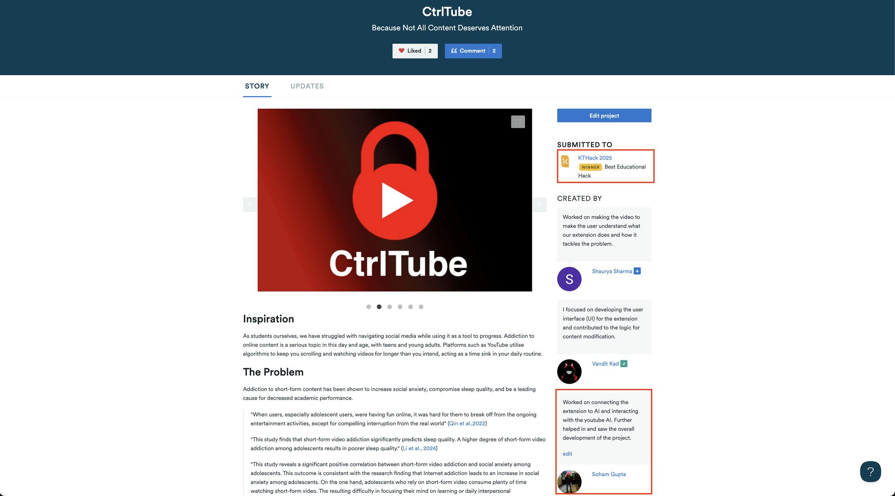

[KTByte](https://www.ktbyte.com/) is a Computer Science Academy whose mission is to make high-quality CS education accessible, engaging, and empowering for students around the world. Their annual hackathon, KTHack, is an international competition open to students across all levels, centred around a theme of Social Impact. KTHack 2025 ran across sub-themes of Financial, Environmental, and Educational Impact, with over $2,000 in prizes.

We were awarded **Best Educational Hack** at KTHack 2025 for **CtrlTube**: a Chrome extension that makes YouTube work for the student rather than against them.

The project came from a problem we felt directly: platforms like YouTube are engineered to keep you watching longer than you intend. Short-form content addiction has been shown to increase social anxiety, compromise sleep quality, and reduce academic performance. We wanted to build something that put the student back in control.

CtrlTube takes your goals as input, then uses the Gemini AI API and YouTube data to filter your feed, blocking videos that don't serve your aspirations and surfacing educational content in their place. For every educational video watched, you earn CtrlCoins, which you can spend as unlocked time on YouTube. Shorts are removed entirely, given the documented impact of short-form content on attention span. The extension is built on the Chrome Extension Framework using JavaScript, with a customisable Gemini prompt at its core.

[**See the full project**](/projects/ctrltube/) &nbsp;|&nbsp; [**View on Devpost**](https://devpost.com/software/ctrltube)
