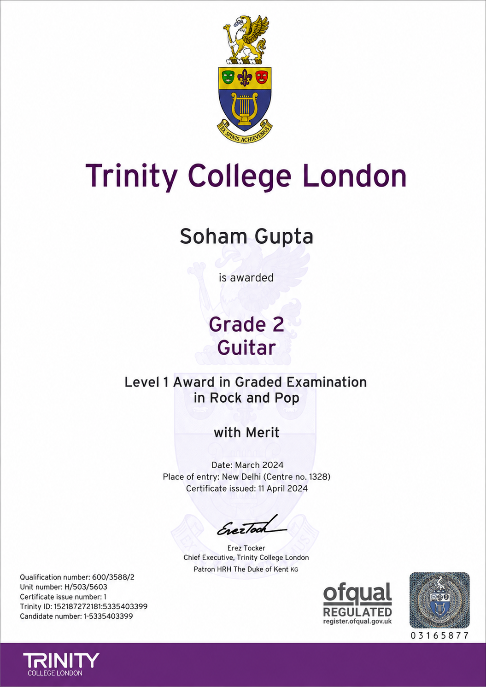

Awarded Grade 2 Rock and Pop Guitar with Merit by Trinity College London (2024), an internationally recognised music examination board. Trinity College London qualifications are accredited by Ofqual and recognised globally.
