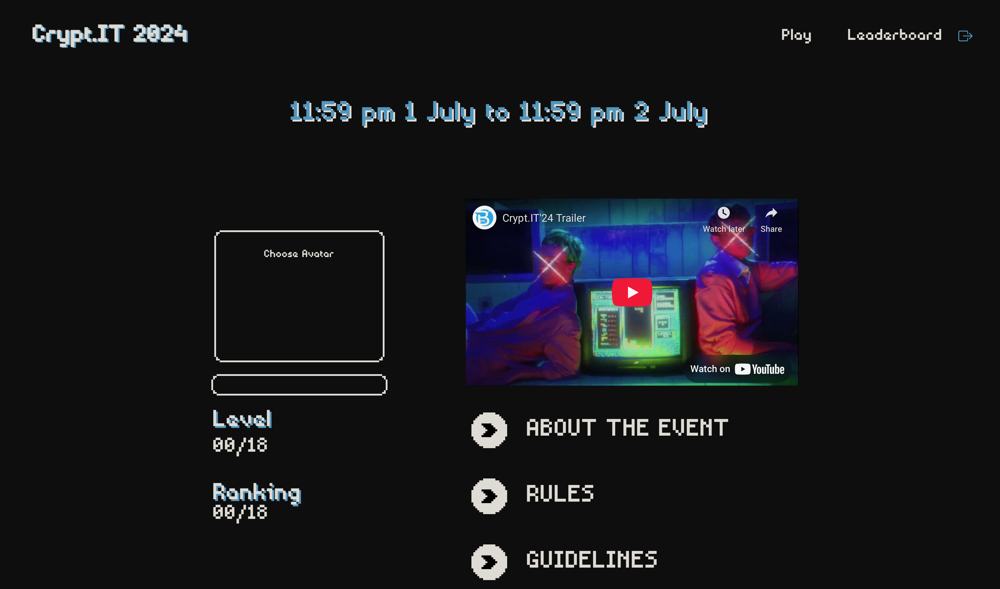
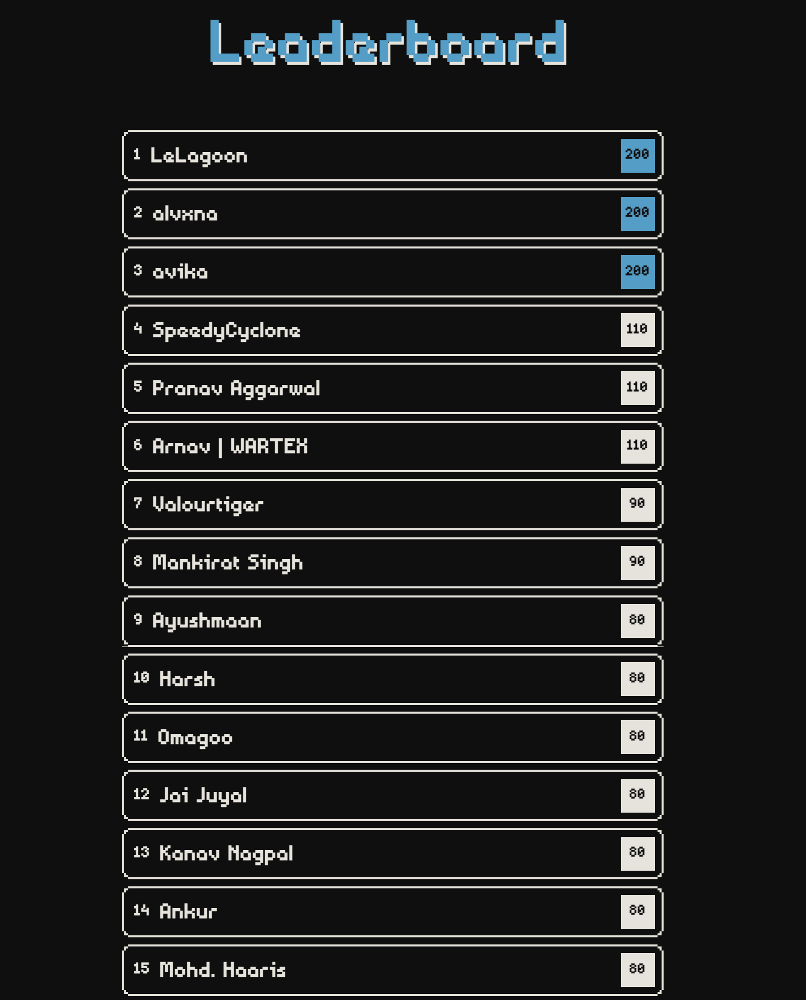






### What is this ?
A lightweight website built to easily and ecnomically host our capture the flag event.


 
### How We Built It ?
Using node.js, mongoDB, html, css, and js, we built a webapp. This allowed us to make a secure way for participants to login, access the questions, and get their answers checked.
 


### Fun Fact
Our competition was supposed to start on 2nd July, but a major setback occoured. The website that our club juniors had built got hacked very soon. So, me and my friend Vandit Kad rebuilt the whole website in a single night and the competition started smoothly on 3rd July.





 
See the website [github](https://github.com/fuel000cynical/CryptIT) or the youtube video for the event [youtube](https://youtu.be/pIC4anJIRFg?si=EjYvpDXV4IZVmF0i)