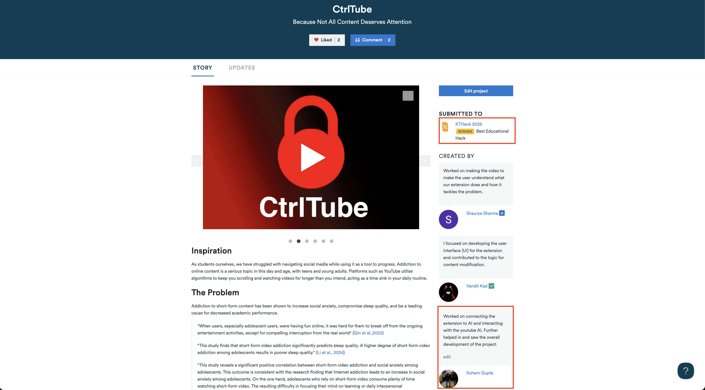
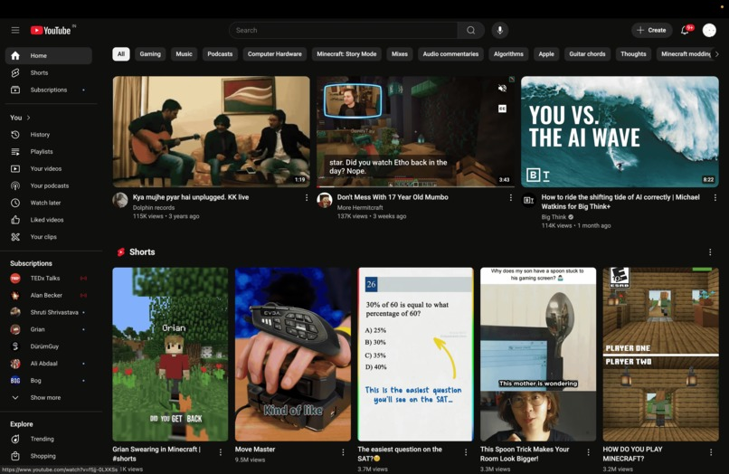
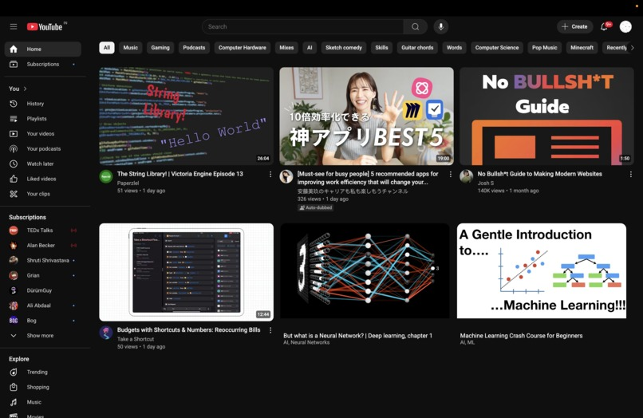
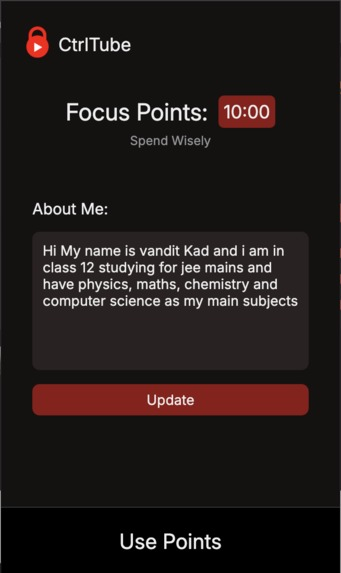

## 📺 CtrlTube – We Manipulated YouTube.

CtrlTube is a Chrome extension that transforms YouTube into your personal learning assistant. No more distractions — just pure, focused, educational content.

We built CtrlTube in under 36 hours at [KT HACK 2025](https://kthack-2025.devpost.com/), and it went on to win the **Best Educational Hack award 🏆**.
 
 

  

## 🎓 What if YouTube actually helped you study?
CtrlTube mutes distractions, highlights educational videos, and keeps your focus in check — all without leaving the platform.
 
 

## 🧠 Why We Built CtrlTube
YouTube is the world's biggest classroom — but it's also the world's biggest distraction engine. We wanted to fix that.

#### CtrlTube is for:

- Students who rely on YouTube for learning
- Self-learners tired of getting pulled into rabbit holes
- Anyone who wants focus-first content consumption

 

## Future Plans
We want to release CTRLTube as an extension on chrome to all everyone to manage their time better and improve the brain food they have.

 

## 📷 Glimpse of the Extension in Action


##### Before




##### After




##### UI



 

## 🛠 Tech Stack
- Manifest V3 Chrome Extension
- JavaScript, HTML, CSS
- Gemini API
 
 

## 🔗 Try It Out
📁 View the GitHub Repository
🌐 Live demo or extension link – coming soon!
 
 

## 💬 Final Thoughts
CtrlTube was more than a hack — it was a statement. A reminder that tools don’t need to be complex to be impactful. Sometimes, the best innovations are the ones that remove distractions rather than add features.

 

## 📹 Promotional Video
<iframe style="width: 45vw; height: 45vh" src="https://www.youtube.com/embed/faodAfjxvBk?si=C9eAh0jK7WKw7H9s" title="YouTube video player" frameborder="0" allow="accelerometer; autoplay; clipboard-write; encrypted-media; gyroscope; picture-in-picture; web-share" referrerpolicy="strict-origin-when-cross-origin" allowfullscreen></iframe>