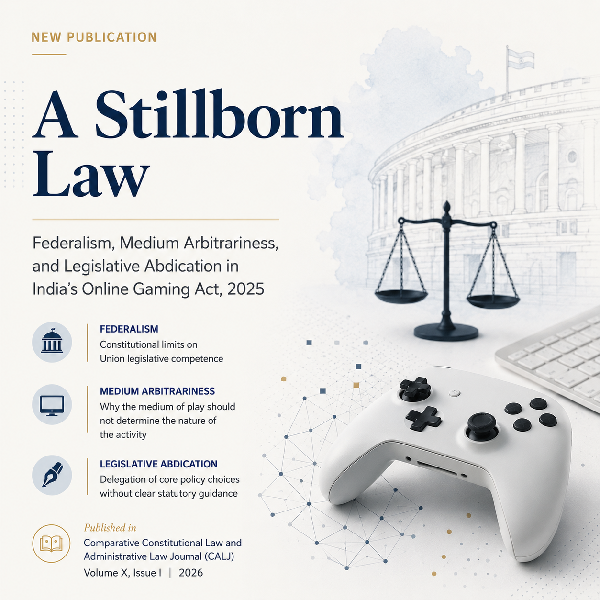

This was my first peer-reviewed journal publication, and it did not begin the way it ended.

I started writing it as a legal and economic review of India's Online Gaming Act, 2025, examining what the Act actually did, what it got wrong, and what its downstream effects on the industry and on users might look like. It was, in retrospect, a competent piece of analysis without a spine. What changed it was the editorial process. The journal's editors flagged something I had mentioned almost in passing: the idea that the Act's problems stemmed not from poor drafting in isolation, but from a more fundamental tendency of legal frameworks to treat the same activity differently simply because it occurs online. They pushed me to put that observation at the centre. The result was *medium arbitrariness*, a framework I had gestured at without naming, which became the paper's core contribution.

The argument is this: online gaming is not a new phenomenon. Gambling, skill gaming, and chance-based entertainment have existed in Indian law for decades. But the moment you place them on the internet, something shifts in the legal imagination. The Online Gaming Act, 2025 imposes a blanket ban on all online money games without distinguishing between games of skill and games of chance, collapsing a distinction Indian courts have maintained since the *State of Andhra Pradesh v. K. Satyanarayana* judgment of 1957. It also bypasses the constitutional mechanisms through which Parliament may legislate on State subjects, effectively encroaching on the residuary powers that flow from Entry 97 of the Union List. And it delegates sweeping enforcement powers to administrative authorities with no clear statutory guidance, raising serious questions of excessive delegation under the principles established in *Delhi Laws Act* and *In Re: The Delhi Laws Act, 1912*. Three failures, compounding each other.

> *"The Act creates what may be described as a case of medium arbitrariness, whereby identical skill-based games are treated differently solely because they are played through a digital medium."*

This is the paper's central claim. The skill-versus-chance distinction is not a technicality. It is the load-bearing structure of how Indian courts have thought about gaming for nearly seven decades. The Act ignores it wholesale. By treating all online money games as equivalent regardless of their underlying character, it renders the settled jurisprudence on skill games effectively inoperative in the online space, without offering any principled basis for doing so.

> *"The medium alone is not a determinative variable to be used to assess a game's legality and effect."*

This follows from the first. If Rummy played in a club is a game of skill and therefore legally protected, it cannot become something else simply because it is played on a phone. The act of digitisation does not alter the cognitive demands of the game, the economic dynamics it produces, or the constitutional category it belongs to. The law, by reasoning otherwise, creates an arbitrary binary that cannot survive scrutiny.

> *"These arguments reveal a three-headed constitutional crisis: federal overreach, medium-based arbitrariness, and legislative abdication."*

The three failures are structurally related. The federal overreach arises because gaming falls under the State List, and Parliament's attempt to regulate it through a central enactment rests on a questionable reading of the residuary entry. The medium-based arbitrariness compounds this by introducing an irrational classification. The legislative abdication ties them together: by leaving core definitional and enforcement questions to delegated authorities, Parliament has avoided the hard choices that responsible legislation requires. The result is a law that is at once constitutionally suspect, doctrinally incoherent, and practically unworkable.

The piece was published in Volume X, Issue I of the **Comparative Constitutional Law and Administrative Law Journal (CALJ)**, published by the Centre for Comparative Constitutional Law and Administrative Law at National Law University Jodhpur, in August 2026. What it taught me, more than anything, was that good editorial feedback does not polish your argument. It finds the argument you were already making and did not know it.

[**Read the article — CALJ**](https://www.calj.in/post/a-stillborn-law-federalism-medium-arbitrariness-and-legislative-abdication-in-india-s-online-gami) &nbsp;|&nbsp; [**SSRN**](https://papers.ssrn.com/sol3/papers.cfm?abstract_id=7019078)
