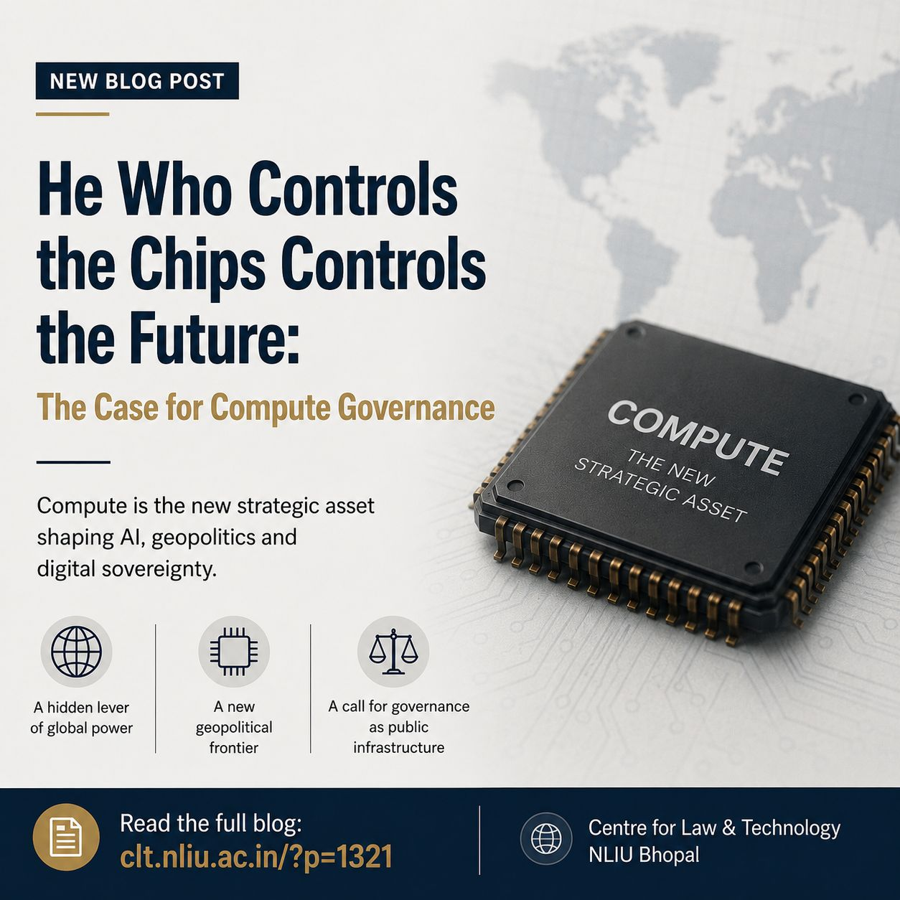

This piece was the first time I engaged in short form writing, i.e. blog, and it was a question that had been bouncing around my mind for quite some time. The thought was pretty simple: if AI needs governance, why are we trying to control concepts which might still be abstract? Everyone was talking about bias, safety, and transparency, which are important things, but nobody was asking the more fundamental question: *who gets to build these models in the first place?* That felt like the elephant in the room, and I wanted to name it.

The blog was published by the **NLIU Centre for Law and Technology, NLIU Bhopal** on April 26, 2026. Writing it taught me how to take a sprawling geopolitical topic and distill it into a legal argument. It also made me realise how much I enjoy sitting at the intersection of technology and public policy, a space I want to keep exploring.

> *"Compute is the new strategic asset shaping AI, geopolitics and digital sovereignty."*

> *"Any robust AI governance policy must thus integrate principles that talk about how one can access, allocate, and monitor compute."*

> *"Treating compute as public infrastructure is not only a metaphorical claim, but something that can be seen to shape reality and, if ignored, change world orders."*

The core argument I make is that AI governance has been built on a hidden assumption: that compute is freely and equally available to all regulated actors. It is not. NVIDIA controls 80 to 90 percent of the GPU market for frontier training. TSMC manufactures nearly all high-performance chips below 7nm. Export controls, cloud pricing policies, and supply-chain chokepoints all quietly determine who gets to participate in the AI revolution, and law has not caught up to that reality.

I also write about India specifically, arguing that the country needs a National Compute Authority, a public GPU infrastructure grid across institutions like IITs and IISc, and mandatory disclosure requirements for large training runs. These are steps toward genuine digital sovereignty rather than passive dependence on foreign compute.

[**Read the full blog**](https://clt.nliu.ac.in/?p=1321)
