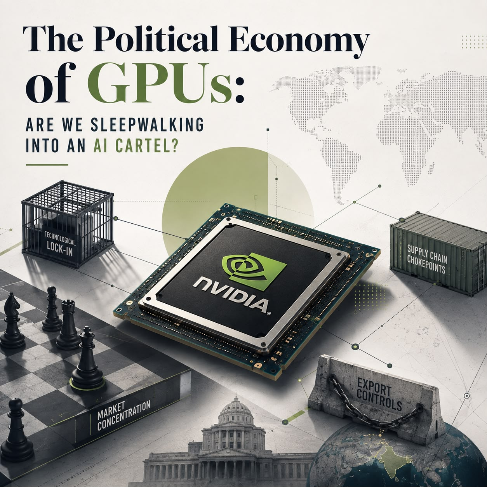

This piece grew out of a question I could not shake after writing [He Who Controls the Chips Controls the Future](/publications/he-who-controls-the-chips/). That blog was about compute governance broadly, and writing it required me to sit with the numbers for a while: NVIDIA holding over 80% of the GPU market, TSMC manufacturing nearly all high-performance chips, a handful of cloud providers controlling access. At some point I stopped reading it as a governance problem and started reading it as a competition law problem. The concentration was there. The pricing power was there. The exclusion of smaller players was there. What was missing was any formal agreement between actors, which meant the traditional cartel analysis did not apply. But the outcomes were the same. I wanted to understand what law could actually say about a market that behaves like a cartel without being one.

> *"NVIDIA doesn't form a cartel in the traditional sense. Yet the current structure of the GPU market shows scarcity, dependency, pricing power, structural exclusion, and geopolitical reinforcement, all behaviours seen in cartels."*

> *"The existing anti-trust laws, particularly India's Competition Act, the EU's Article 102 TFEU, or the U.S. Sherman Act, were not built to handle bottlenecks which are essential facilities located outside the country's jurisdiction."*

> *"AI is said to be the defining technology of the century, with compute being its essential facility. In the present arrangement, India can be locked out of this facility."*

That became the blog. I went back to the competition law cases I had been studying and tried to run the GPU market through them systematically. The essential facility doctrine in *Aspen Skiing* and *Oscar Bronner*, the vertical foreclosure analysis from *Microsoft* and *Google Shopping*, the market definition standards from *United Brands* and *Brown Shoe*. None of them fit perfectly, and that imperfect fit was itself the point. The law was not built for a market like this, where the chokepoint is a software ecosystem developed over a decade, and the foreclosure happens across hardware, networking, and tooling simultaneously. The India section came last and felt the most urgent to write, because the scarcity and pricing effects that are theoretical problems for competition law are already lived realities for Indian researchers and startups.

The piece was published by the **NLIU Centre for Law and Technology, NLIU Bhopal**.

[**Read the full blog**](https://clt.nliu.ac.in/?p=1377)
