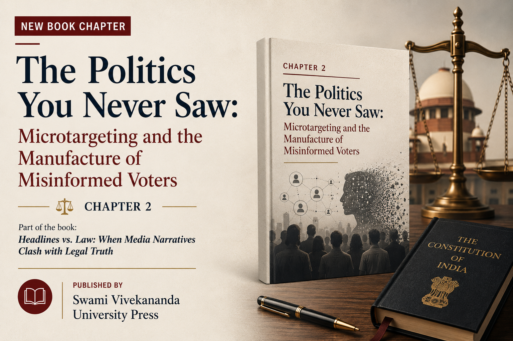

This is Chapter 2 of the book *Headlines vs. Law: When Media Narratives Clash with Legal Truth*, co-authored with **Prabhas Kumar** and published by **Swami Vivekananda University Press**. The chapter sits at an intersection that I find genuinely alarming: the gap between how electoral law was designed to work and how political persuasion actually operates today.

The idea for this chapter came from two papers we were reading at the time. Sayantan Chanda's "Data Privacy And Elections In India: Microtargeting The Unseen Collective" (*Indian Journal of Law and Technology*, Vol. 18, Iss. 2, 2022, [available here](https://repository.nls.ac.in/ijlt/vol18/iss2/1)) argued that individual-centric data privacy frameworks are structurally blind to the collective harms of microtargeting, proposing instead a framework of "collective privacy." The second was Freek van Gils, Wieland Müller, and Jens Prüfer, "Microtargeting, Voters' Unawareness, and Democracy" (*Journal of Law, Economics, and Organization*, DOI: [10.1093/jleo/ewae002](https://doi.org/10.1093/jleo/ewae002)), which formally modelled how microtargeting exploits voter unawareness to shift electoral outcomes. Reading both together made a question crystallise: what is the law actually equipped to see here, and is it looking in the right place?

> *"Microtargeting manufactures electoral misinformation without ever having to speak an untruth."*

> *"The harm does not lie in voters being told something wrong. It lies in voters being shown only a fragment of the political reality they are being asked to choose from."*

> *"The harm, then, is not privacy. It is not persuasion. It is not falsity. It is the slow, quiet collapse of shared political reality."*

The chapter argues that Indian electoral law has a structural blind spot. The Model Code of Conduct, the Representation of the People Act, and the DPDP Act were all designed for a world where persuasion is visible. They police rallies, speeches, pamphlets and posters. They assume that if something goes wrong, it will happen loudly, generate a headline, and become something the law can see. Political microtargeting breaks that assumption completely, and does so without breaking a single black-letter rule.

We also examine why the comparative fixes have failed. US-style ad transparency libraries show ads one by one and never reveal the whole campaign, so contradictory promises to different communities remain invisible together. The EU's content regulation approach under the Digital Services Act caused Meta and Google to withdraw political advertising from the platform entirely, pushing persuasion into influencers and encrypted channels. Restraint, transparency, and content control all share the same flaw: they are designed to catch falsehood. Strategic omission is not falsehood. It is selective truth.

The answer we propose is procedural. Rather than policing what campaigns say, the law must restore the shared field of contestation within which democratic disagreement can still occur. Oversight bodies must be able to see the informational terrain elections are actually fought on. Rival campaigns must be able to hear what is being promised to others. The law should intervene not to police truth, but to restore the conditions under which democracy can still recognise itself.

[**Access the full book**](https://www.swamivivekanandauniversity.ac.in/backend/resource/assets/images/book/1769847655Headlines%20Vs.%20Law_final.pdf)
